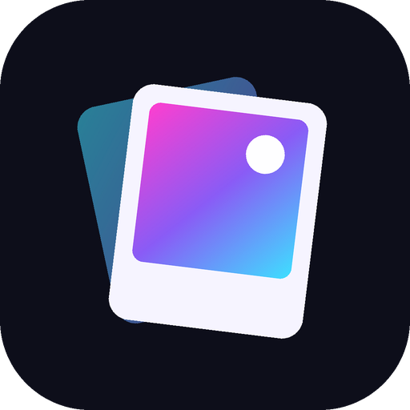
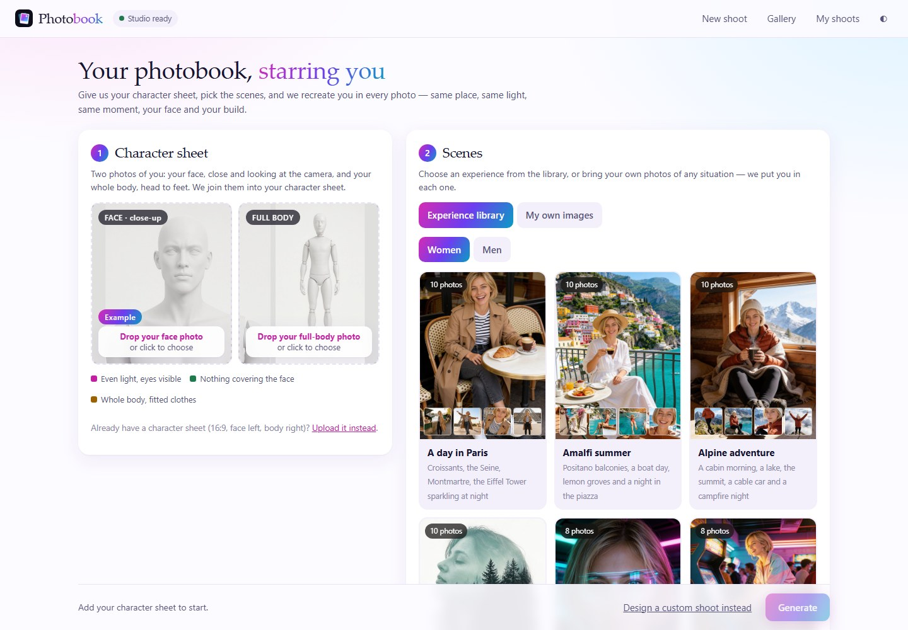
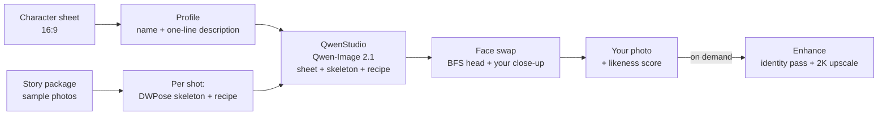

<p align="center"></p>

<h1 align="center">Photobook</h1>

<p align="center"><b>Your photobook, starring you.</b><br>
A local photoshoot app: give it two photos of you, pick a story, and it recreates you in every photo —<br>
same place, same light, same moment, your face and your build.</p>

<p align="center"></p>

---

## What it does

1. **You add two photos**: your face, close and looking at the camera, and your whole body,
   head to feet. Photobook crops both the same way for everyone (head and shoulders around the
   detected face; the whole person found by DWPose) and stitches them into your 16:9
   **character sheet**. (Already have a sheet? You can upload it instead.)
2. **Photobook writes your profile**: a name, and one line describing you (age, hair,
   beard, build) that an AI writes and you can correct. That line goes into every photo.
3. **You pick a story** from the Experience library — *A day in Paris*, *Amalfi summer*,
   *Alpine adventure*; conceptual ones — *Abstract art portraits*, *Sci-fi 2089*, *Back to the
   80s*; or illustrated ones — *Comic book hero*, *Manga summer*, *Pixel quest*, *3D animated day*.
   Each comes in a women's and a men's version.
   Preview every photo and leave out the ones you don't want.
4. **Generate.** Every photo is regenerated with you in it (not a face swap): the sample's
   pose and moment, the place and light, your identity. Finished photos appear as they land.
5. **Enhance** any photo you love (a second identity pass + 2K upscale), mark favourites,
   download the set. Everything you make stays in the **Gallery**, grouped by character.

Everything runs on your machine. Your photos never leave it.

## How it works



- **The engine is [QwenStudio](https://github.com/amortegui84/Qwen_studio)** (Qwen-Image 2.1, local).
  Photobook never loads a diffusion model itself; it talks to QwenStudio over HTTP on
  `127.0.0.1:7860`, one job at a time, with a cool-down between photos.
- **A package is a story**: sample photos plus, for each shot, a *recipe* (what is happening,
  where, the light, the outfit — always "the subject", never the sample person's looks) and
  the sample's **DWPose skeleton**. Your photo is generated from your sheet + that skeleton +
  that recipe + your profile line. The sample image itself is never fed to the model, so no
  one else's face can leak into yours.
- **Face swap on every photo**: right after a photo is composed, the
  [BFS](https://huggingface.co/Alissonerdx/BFS-Best-Face-Swap) head-swap LoRA puts the head from your
  close-up on it, keeping the scene, the outfit, the pose and the expression — also in comic and 3D
  styles. The composed photo stays as *Before*. The installer downloads and converts it into
  QwenStudio's `loras/`; without it, photos come out as composed. Far shots (a tiny face) gain little.
- **A personal likeness model (optional)**: a person can also have a LoRA trained on them, set up
  behind the scenes; it is used at a low weight while composing and inside the face swap.
- **Likeness** is measured with ArcFace against your close-up and shown on each photo.
- **Enhance** (on demand) re-draws the whole photo at 1 MP with your close-up as reference,
  then upscales it to 2K — no mask, so no seams.
- **Libraries are drawn on fal** (ByteDance Seedream 4.5, 4K masters, $0.04 an image — the whole
  library's new photos cost about $6.50) so building them never uses your GPU. Clients' photos are always made locally.

The reasoning behind every default — resolutions, steps, what was tried and dropped — is in
[docs/DECISIONS.md](docs/DECISIONS.md).

## Requirements

| | |
|---|---|
| **QwenStudio** | installed and working (it has its own installer and downloads the ~33 GB of weights on first run). It needs a CUDA GPU (developed on an RTX 5090) or Apple Silicon. |
| **Photobook** | Windows 10/11 or macOS, ~1 GB of disk for its environment and models. No GPU of its own: its helpers run on the CPU. |
| **Internet** | only to install, and for fal if you build new libraries. |

## Install

1. Install and start **QwenStudio** once, so its weights are downloaded.
2. Get Photobook next to it (the installer looks for a `QwenStudio` folder beside it, or on
   `C:\ … G:\`):
   ```bash
   git clone https://github.com/aaronamortegui-glitch/photobook.git
   ```
3. Run the installer:
   - **Windows:** double-click `INSTALL.bat`
   - **macOS:** double-click `install.command` (first time: right-click → Open)

   It downloads [uv](https://github.com/astral-sh/uv) and a private Python 3.12 into the app
   folder (nothing on your system is touched), installs the light dependencies
   (`requirements.txt`, no torch), fetches the ArcFace and DWPose models, finds QwenStudio
   and writes `config.json`. On Windows it also puts a **Photobook** shortcut on your desktop.

## Run

- **Windows:** the desktop shortcut, or `RUN.bat`
- **macOS:** `run.command`

It starts the image engine (QwenStudio) **in the background** if it is not running yet — no
window, no console of its own; its output goes to `logs/qwenstudio.log` — waits for it, starts
Photobook and opens **http://127.0.0.1:7870** in your browser. Closing Photobook closes the
engine it started. The pill at the top says *Studio ready* when the engine answers.

## Using it

| Step | Where | Notes |
|---|---|---|
| Someone saved | *1 · Character sheet* | Everyone photographed before is listed above the two slots (and has **＋ New shoot** in the Gallery): one click brings back their photos, sheet, description and LoRA — nothing to upload again. |
| Two photos | *1 · Character sheet* | Face: even light, eyes visible, nothing covering it. Body: head to feet, fitted clothes. Any size or distance — they are cropped and scaled to the same layout. |
| Profile | under the sheet | The description is written for you — fix anything wrong, **in any language**: it is translated to English locally (the model reads English best). Describe the person, never the clothes. You can type while the AI one is still being written. |
| Likeness model | the profile | Shown only as *active* or *not set up*: it is set up behind the scenes (`herramientas/asignar_lora.py`), never chosen by the client. When active, every shoot of that person uses it with the face photo (`docs/DECISIONS.md`). |
| Scenes | *2 · Scenes* | *Experience library* (Women / Men). Click a sample to preview; the ✓ leaves it out. |
| Generate | bottom bar | About 100 s per photo on an RTX 5090. The first two arrive within minutes. |
| Stop | the shoot's page | Stops **now**: the photo in progress is aborted within seconds, and a restart never resumes a stopped shoot. |
| Enhance · Favourite · Save · Delete | click a photo | The photo opens at once (a light version first, the full one right after); Esc, × or the back button close it. Enhance is best on full and half-body shots. Deleting goes to a trash with **Undo**. |
| Gallery | top bar | One card per character: rename ✎, delete 🗑 (with Undo), filter by enhanced, favourites or story. |

Where things are saved: `sesiones/<id>/` — `entrada/` (your sheet), `fotos/` (`NN_raw.png`,
`NN_enh.png`), `estado.json`. Deleted photos go to `sesiones/<id>/_papelera/`, deleted
characters to `sesiones/_papelera/`. Profiles live in `sesiones/_personajes.json`.

## Building libraries

A package is a folder `catalogo/paquetes/<id>/` with `paquete.json`, sample photos and
their skeletons.

**From your own folder of photos** (any photos, no naming rules):
```bash
.venv\Scripts\python.exe herramientas\importar_carpeta.py "C:\path\to\photos" my_trip "My trip"
```
It copies them, draws each skeleton and reads each photo (place, outfit, pose, expression,
light) into a recipe. Open `paquete.json` afterwards and correct the recipes — that is the
curation step.

**A new story drawn on fal** (needs `FAL_KEY=...` in a `.env` file in the app folder):
1. Add the story to `herramientas/libreria_historias.py` (shots: framing, camera, action,
   place, optional outfit) and run it to write `paquete.json`.
2. `herramientas/crear_paquete_fal.py <id>` — draws the samples in 4K on Seedream 4.5
   (`PHOTOBOOK_MOTOR_LIBRERIA=seedream`; `nbpro` and `sunburst` also work) (masters kept in
   `catalogo/_masters/`, 2048 px copies in the package), then
   `herramientas/recortar_muestras.py <id>` crops each copy to a ratio QwenStudio can make.
3. `herramientas/esqueletos_paquete.py <id>` then `herramientas/preparar_paquete.py <id>`
   (QwenStudio running) — skeletons and recipes.

**Curating a package:** to take a sample out of the library, delete its `NN.jpg` (and
`NN_pose.png`) from the package folder — the shot is no longer offered. No need to edit
`paquete.json`.

## Configuration

`config.json` (written by the installer):

| key | default | |
|---|---|---|
| `qwenstudio` | found by the installer | QwenStudio's folder, started by `RUN.bat` when needed |
| `qwen_url` | `http://127.0.0.1:7860` | QwenStudio's API |
| `puerto` | `7870` | Photobook's port |

Environment variables: `PHOTOBOOK_INSIGHTFACE` (ArcFace model folder), `PHOTOBOOK_COMFY_PY`
(only for the optional SAM 3 masks), `FAL_KEY`. `iniciar_ui.py` serves the page on 7871
without the worker — for trying the interface while 7870 is generating.

## Troubleshooting

- **"Checking studio…" never turns green** — QwenStudio is not answering on 7860. Start
  `QwenStudio\RUN.bat` and wait for its model to load.
- **Photos fail / CUDA errors in QwenStudio's console** — the GPU driver reset under load.
  Restart QwenStudio, then Photobook: a shoot that was still running resumes where it stopped.
- **The description says "Describing you…" for a while** — it is written between two
  photos of a running shoot, so the GPU is never shared.
- **No skeleton for a sample** (tiny pixel-art hero, a body seen from straight above) — the
  shot is regenerated from its words alone.

## Project layout

```
photobook/          the app: servidor.py (HTTP), servicio.py (sessions + worker),
                    motor_qwen.py (QwenStudio client), tomas.py (packages), caras.py and
                    herramientas/faceid.py (ArcFace), pose.py (DWPose), detailer.py (Enhance),
                    lectura.py (photo reading), lanzar.py (start-up), web/ (the page, icon)
catalogo/           the library: paquetes/<story>_<f|m>/, poses/ (custom shoots), thumbs/
herramientas/       library tools: libreria_historias.py, crear_paquete_fal.py,
                    esqueletos_paquete.py, preparar_paquete.py, importar_carpeta.py, icono.py
docs/               DECISIONS.md, screenshot
INSTALL.bat · RUN.bat · SHORTCUT.bat · install.command · run.command · instalar.py
```
Not in the repository (made on your machine): `.venv/`, `.uv/`, `modelos/`, `sesiones/`,
`config.json`, `.env`, `catalogo/_masters/`.

## Licences and credits

- **Qwen-Image 2.1** (Alibaba Qwen team) runs inside QwenStudio — see its licence.
- **ArcFace buffalo_l** from [InsightFace](https://github.com/deepinsight/insightface):
  the pretrained models are released for **non-commercial research use only**. For a
  commercial service, replace the likeness score with a model licensed for it.
- **DWPose** ([IDEA-Research/DWPose](https://github.com/IDEA-Research/DWPose), Apache-2.0), run through
  [easy-dwpose](https://pypi.org/project/easy-dwpose/) on onnxruntime.
- **BFS — Best Face Swap** head v1.1 for Qwen-Image 2.1 ([Alissonerdx](https://huggingface.co/Alissonerdx/BFS-Best-Face-Swap), MIT):
  downloaded by the installer. Use it only with photos of people who have given consent.
- **fal / Seedream 4.5** (ByteDance): a paid API, used only to draw library samples.
- Library samples show generated house models, not real people.
